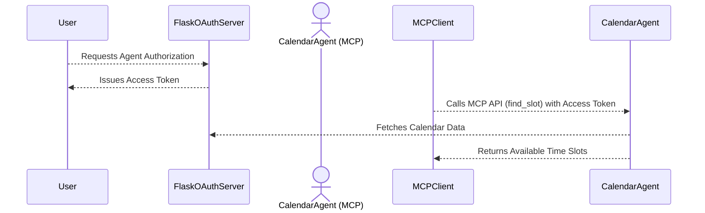

# **Authenticated Delegation and Authorized AI Agents – Toy Demo with MCP Interaction**

This repository demonstrates a **toy example** of **agentic delegation** and
**authorized AI agents**, inspired by
[arXiv-2501.09674](https://arxiv.org/abs/2501.09674), integrated with the
**Model Context Protocol (MCP)**.

## **Overview**

This demo showcases **AI-driven delegation**, where a **CalendarAgent** is
authorized to access a user's calendar and retrieve **available time slots**.
The **agent runs as an MCP server**, exposing an API for querying availability.

### **Key Workflow**
1. A **Flask OAuth server** issues an **access token**, authorizing the
   **CalendarAgent** to access a user’s calendar.
2. The **CalendarAgent (MCP server)** fetches **available time slots** using the
   **delegated token**.
3. An **MCP client** interacts with the agent via **MCP APIs** to request
   available times.

This pattern enables **secure, structured, AI-driven workflows**, such as:
- AI assistants managing **personal schedules**.
- AI-powered bots handling **automated scheduling** via **MCP APIs**.

---

## **Architecture**

This demo runs **two parallel servers**:

1. **Flask OAuth Server**  
   - Simulates an **OAuth-based delegation system**.
   - Issues **delegation tokens** that authorize agent access.

2. **MCP CalendarAgent**  
   - Runs as an **MCP server**, exposing an API to query **available calendar
     slots**.
   - Requires an **access token** to retrieve availability.

---

## **Sequence Diagram**



---

## **Demo Components**

### **1. Flask OAuth Server**
- Issues **delegation tokens** that authorize the **CalendarAgent**.
- Simulates **secure access control** for AI agents.

### **2. MCP CalendarAgent**
- Runs an **MCP server** implementing:
  - **`find_slot`** – Retrieves available time slots from the user's calendar.
- Requires an **OAuth access token** for authorization.

### **3. MCP Client**
- Interacts with the **CalendarAgent** via **MCP APIs**.
- Calls **`find_slot`** to fetch available meeting times.

---

## **Running the Demo**

### **1. Install Dependencies**
```bash
pip install flask mcp dotenv
```

### **2. Start the Flask OAuth Server**
```bash
python server.py
```
- This starts the **OAuth delegation server** on `http://localhost:5000`.

### **3. Start the MCP Calendar Agent**
```bash
python mcp server.py
```
- This starts the **MCP agent**, which exposes the **`find_slot`** API.

### **4. Run the MCP Client**
```bash
python client.py
```
- This client will:
  - **Authenticate** via the **OAuth server**.
  - **Obtain an access token**.
  - **Invoke MCP API (`find_slot`)**.
  - **Print available times**.

---

## **Limitations**
- **Single-Level Delegation:**  
  - The demo supports **direct delegation** but does not implement **multi-hop
    agent delegation**.
- **Mock Calendar Data:**  
  - The **calendar availability** is simulated with static data.
- **Simplified OAuth Flow:**  
  - No **PKCE, refresh tokens, or user account management**.

---

## **Next Steps**
- Extend the system to support **multi-agent delegation**.
- Implement **real calendar integration** (Google Calendar, iCal, etc.).
- Expand authorization with **OAuth refresh tokens**.

---

This demo provides a **starting point** for **AI-driven delegation workflows**
using **MCP**, **OAuth**, and **agent-based automation** but much more work is
to be done to improve advance the flows. 🚀
