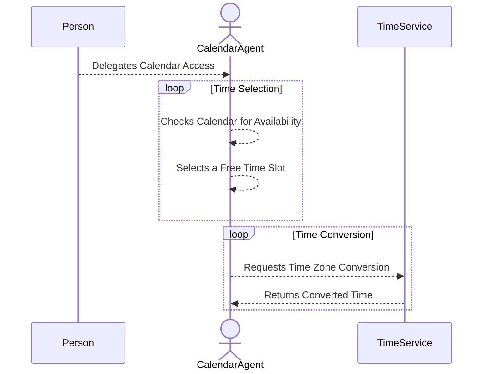

# Authenticated Delegation and Authorized AI Agents – Toy Demo with MCP Interaction

This repository demonstrates a toy example of **agentic delegation** and
**authorized AI agents**, inspired by
[arXiv-2501.09674v1](https://arxiv.org/abs/2501.09674) and integrated with the
**Model Context Protocol (MCP)**.

## Overview

The goal of this demo is to showcase **delegated resource access** in an
AI-driven workflow. Specifically, it demonstrates how a **CalendarAgent** is
granted **view access** to a calendar resource and subsequently interacts with
an external service to adjust time zones.

### Key Interactions:

1. A **person delegates calendar access** to the **CalendarAgent**.
2. The **CalendarAgent** reads the calendar and selects an available time slot.
3. The **CalendarAgent** invokes the **Model Context Protocol (MCP)** to request
   a **time zone conversion service**.
4. The service responds with the adjusted time.

Although this is a simple toy example, the same pattern applies to **more
complex agentic interactions**, such as:

- A user delegating access to an AI assistant for managing **personal data**
  (e.g., address information).
- The assistant using that data to interact with an MCP service for **automated
  booking or registrations**.

## Sequence Diagram

## Limitations

- **Limited Delegation Depth:** The demo does not yet support **multi-hop
  delegation chains**, where an agent delegates access further down a chain.

This example serves as a foundation for exploring **authenticated delegation,
agentic workflows, and AI-driven automation** using the **Model Context
Protocol**.

