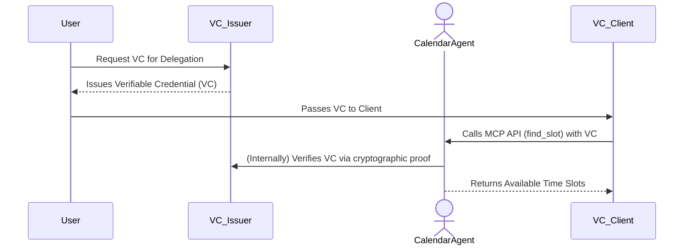

# Authenticated Delegation and Authorized AI Agents – VC-Based Delegation Demo with MCP Interaction


> This repository is in progress

This demo showcases **agentic delegation** and **authorized AI agents** inspired by [arXiv-2501.09674](https://arxiv.org/abs/2501.09674) and integrated with the **Model Context Protocol (MCP)**. Unlike the OAuth-based approach, this spinoff leverages **Verifiable Credentials (VCs)** for delegation instead of opaque OAuth access tokens.

---

## Overview

In this demo, a **CalendarAgent** is authorized to access a user's calendar and retrieve available time slots using a verifiable credential rather than an OAuth token. The system now operates as follows:

1. **VC Issuance:**  
   A dedicated **VC Issuer** creates a cryptographically signed Verifiable Credential that explicitly grants the delegation permission (e.g., `calendar.view`) to the agent. This VC is issued to the user (the VC Holder).

2. **VC Presentation:**  
   The user presents the VC to the **CalendarAgent (MCP server)** when making a request. The VC encapsulates all the delegation details—who is allowed to act, for how long, and with what permissions.

3. **VC Verification:**  
   The **CalendarAgent** validates the VC by checking its signature, expiration, and permissions. If the VC is valid and contains the required `calendar.view` permission, the agent executes the requested action.

4. **MCP Interaction:**  
   An **MCP client** interacts with the agent via MCP APIs, using the VC to authorize the agent’s actions.

This VC-based approach offers decentralized trust, enhanced privacy, and clear, self-contained delegation details.

---

## How This Differs from the OAuth Approach

### OAuth-Based Delegation
- **Centralized Token Issuance:**  
  A central OAuth server issues opaque access tokens after authenticating the user.
  
- **Opaque and Indirect:**  
  The access token is a reference that requires introspection by the agent to verify delegation rights.
  
- **Coupled Authorization:**  
  The OAuth server handles both user authentication and token management, which can lead to tighter coupling and reduced flexibility.

### Verifiable Credential-Based Delegation
- **Decentralized Issuance:**  
  A dedicated **VC Issuer** issues cryptographically signed VCs that explicitly state the delegation rights.
  
- **Self-Contained Credentials:**  
  The VC itself carries all the necessary information (issuer, permissions, expiration) so that the agent can validate it without needing to query a central authority.
  
- **Enhanced Privacy & Security:**  
  VCs support selective disclosure, meaning the holder can share only the necessary attributes. They also rely on standards (e.g., W3C Verifiable Credentials) to foster trust and interoperability.
  
- **Flexible Trust Model:**  
  Any trusted issuer can grant delegation rights, enabling a more decentralized and robust authorization framework.

---

## Running the Demo

### Components

1. **VC Issuer**  
   - Issues Verifiable Credentials (VCs) that grant delegation rights.
   - Runs on port 8000.

2. **MCP CalendarAgent**  
   - Runs as an MCP server (port 9000) exposing an API (e.g., `find_slot`) to retrieve available calendar slots.
   - Requires a valid VC to process requests.

3. **VC Client**  
   - Requests a VC from the issuer.
   - Uses the VC to call the MCP agent’s API.

### Instructions

1. **Start the VC Issuer:**  
   ```sh
   python vc_issuer.py
   ```

2. **Start the MCP CalendarAgent:**  
   ```sh
   python vc_agent.py
   ```

3. **Run the VC Client:**  
   ```sh
   python vc_client.py
   ```

The client will request a VC from the issuer and then call the agent with the received VC. The expected output will show the agent’s response with the next available time slot.

### Expected Client Output

```sh
Requesting Verifiable Credential (VC)...
Received Verifiable Credential: eyJhbGciOiJIUzI1Ni...

Calling agent with VC...
Agent Response:
{
  "agent_result": {
    "start": "2025-03-01T11:45",
    "end": "2025-03-01T12:15"
  }
}
```

---

## Sequence Diagram



---

## Benefits of VC-Based Delegation

- **Decentralized Trust:**  
  Eliminates the need for a single point of failure by allowing independent VC verification.

- **Transparency and Auditability:**  
  The VC clearly states who is delegated, with what permissions, and for how long, making it easier to audit and verify.

- **Enhanced Privacy:**  
  VCs support selective disclosure, enabling users to share only the necessary attributes without exposing extra personal data.

- **Standards-Based Interoperability:**  
  Leveraging W3C Verifiable Credentials standards paves the way for broader adoption across decentralized systems and identities.

- **Reduced Coupling:**  
  With the VC containing all required delegation details, the CalendarAgent can validate credentials independently without tight integration with a central auth server.

---

## Limitations and Next Steps

- **Simplified Proof Format:**  
  This demo uses JWT-signed VCs. Future work could incorporate more advanced proof formats (e.g., LD-Proofs).

- **Placeholder DIDs:**  
  The demo uses example DIDs. Integration with a fully-fledged decentralized identity (DID) ecosystem is a next step.

- **No Revocation Mechanism:**  
  The current implementation does not support credential revocation or more granular access control mechanisms.

- **Production-Grade Features:**  
  Additional features such as secure key management, advanced verification, and more comprehensive permission models will be necessary for a production system.

---

This spinoff demo demonstrates a modern, decentralized approach to agentic delegation using Verifiable Credentials instead of OAuth tokens. By leveraging VC-based delegation, the system benefits from enhanced security, privacy, and interoperability—paving the way for next-generation AI-driven automation workflows. 🚀
